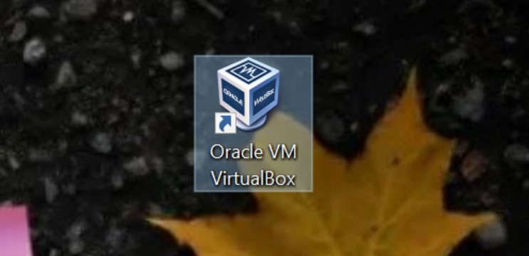
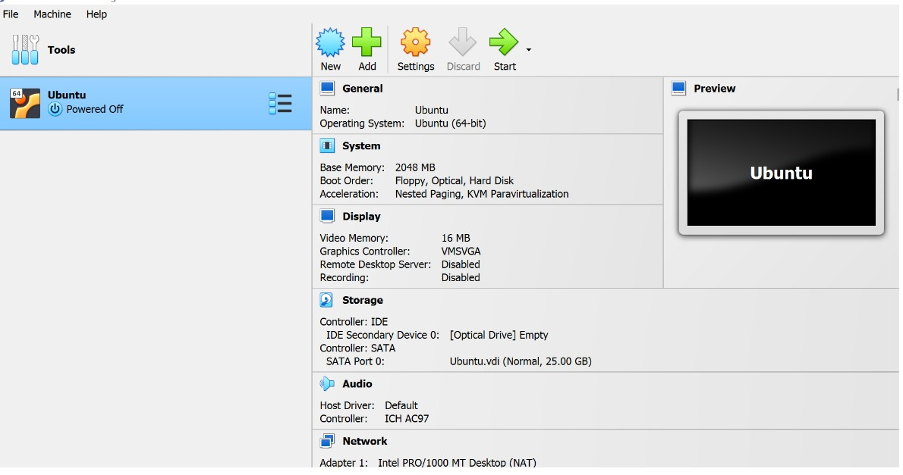
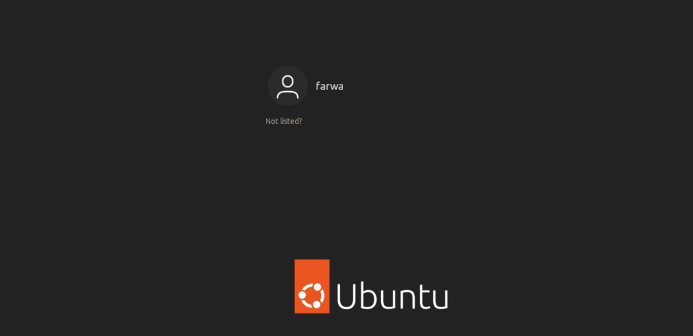
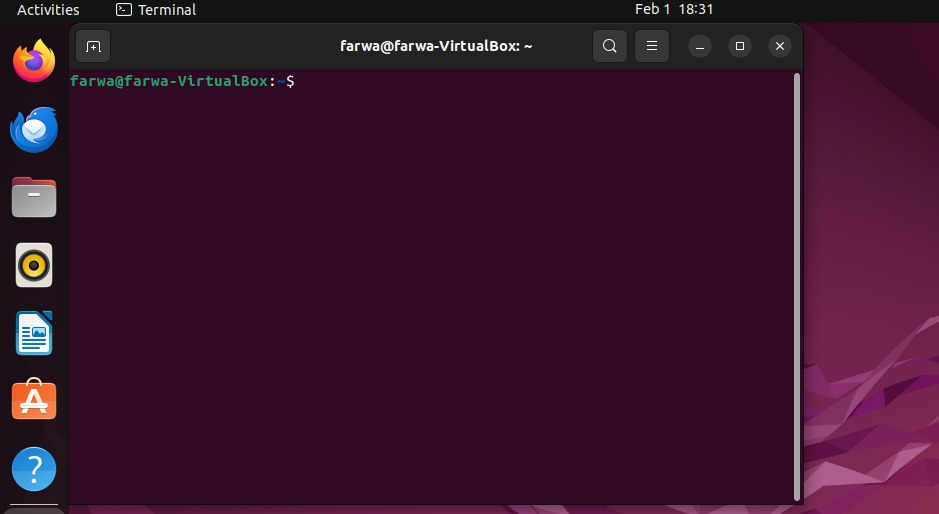
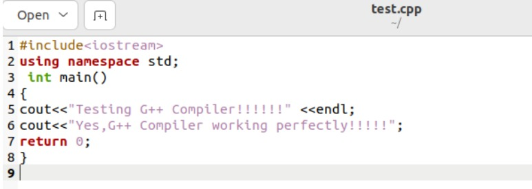
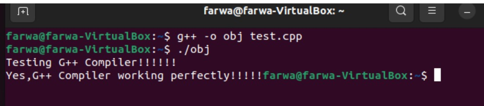
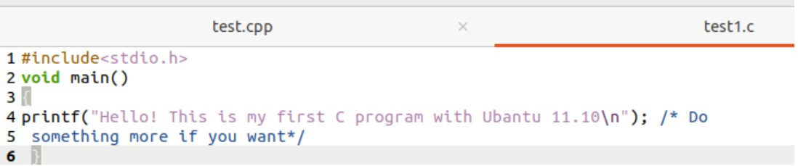
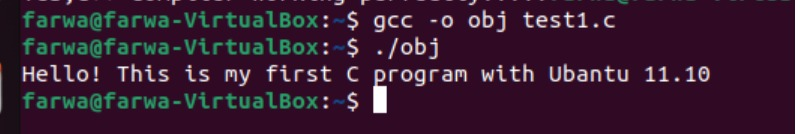

<h1 style="text-align: center;"> Operating System</h1>

​                                                                              Session: 2022-2026

<h3 style="text-align: center;">  Submitted by:</h3>                                                                                                  

​                                                                 Umm E Farwa           2022-R/2021-CS-158
<h3 style="text-align: center;">   Submitted To:</h3>                                                                                                  

​                                                                                 Mr. Numan Shafi

<h3 style="text-align: center;">   Department of Computer Science</h3>                                                                
<h3 style="text-align: center;">    University of Engineering and Technology</h3>                                                  

<h3 style="text-align: center;">    Lahore, Pakistan.</h3>                                                                                   

# Task 1

## 1.1    VMware player Installation

I have downloaded the VMware player from the VMware official website. After that I have followed all the instructions provided by teacher. I didn’t know about the VMware player enough. But I am ready to learn new things. I also want to add that VMware player is a virtualization software. That will help me to run my ubuntu operating system virtually on my windows operating system.

## 1.2    Ubuntu Installation

After that I have downloaded the ubuntu operating system iOS file. Again, everything was mentioned in teacher’s provided manual. I didn’t get difficulty in installing the ubuntu.

## 1.3    Installing Required Compilers

After that I have installed compilers to run the c plus plus and c language files. 

For c language code: sudo apt install gcc

For c++ language code: sudo apt install g++

## 1.4    Conclusion

 I have successfully installed Ubuntu on VMware and set-up the virtual environment on my personal computer.

## 1.5    Screen Shots

 

 

 

 

 

# Task2

## 2.1    Example 1: Testing G++ Compiler

- I have created file named test.cpp using touch command. After that I have opened the test.cpp file and write the provided code by our instructor.

- After that I have saved the file and compile the file from the terminal using this command `g++ -o obj test.cpp` and then run the compiled obj file simply writing ./obj on terminal.

- After that `Testing G++ Compiler!!!!!!!Yes, G++ Compiler working Perfectly!!!!!!!` appears on terminal that pleases me.

  ## Screen shots

  ###  Code

  

###       Output

 

## 2.2    Example 2: Testing GCC Compiler

- Again, I have created the the test1.c file using touch command. And write the example code in it and             then saved the file.

- Then, its time to compile the code. I compiled my file using `gcc -o obj test.c`. 

- After that I have run the compiled file using `./obj` on terminal.

- Then the terminal displays `Hello! This is my first C program with Ubuntu 11.10`

  ## Screen shots

  ### code
  

  Output

 

# Task 3

[Github Link](https://github.com/Farwa512/OS-LAB2.git)

